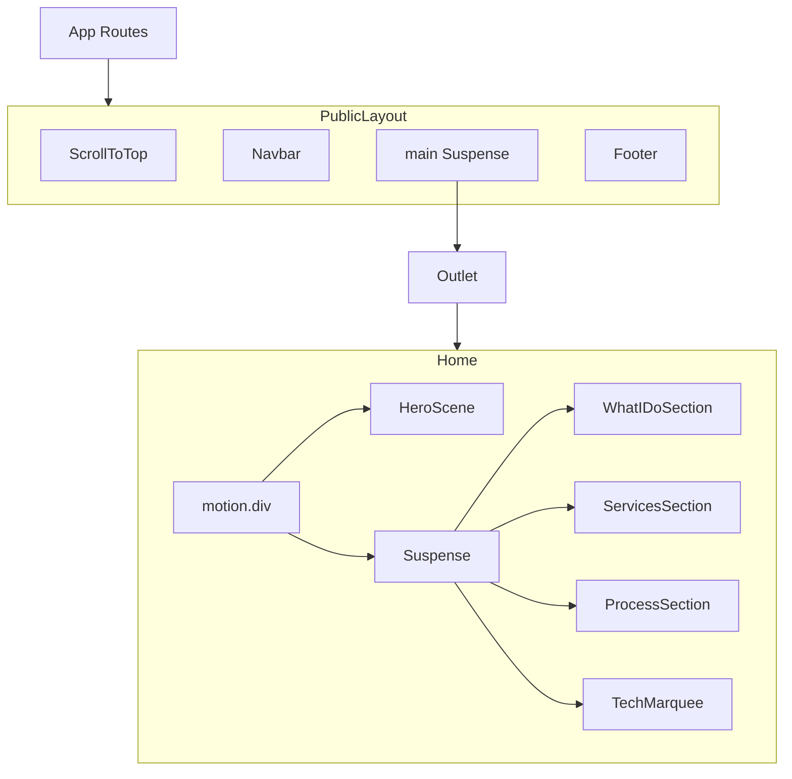

# Home Page Reference — Nexus Portfolio (Public Site)

This document describes the **Home** route implementation in the `port-front` repository: layout, visual system, component structure, motion, data, and migration notes. It is intended so another engineer or AI can rebuild the same page in a different project without guesswork.

---

## 1. Overview

### What the Home page is

The Home page is the **primary marketing landing** for the public portfolio. It composes:

- A **full-viewport hero** with headline, supporting copy, primary/secondary CTAs, scroll affordance, and (on desktop) a **right-column visual** powered by **Spline** (3D Web).
- Four **below-the-fold sections**: expertise grid (“What I Do”), three large service cards (“Services”), a four-step **process timeline**, and a **dual-row infinite tech marquee**.

### Role in the portfolio

- Acts as the **default entry** at `/`, introducing the “Nexus” brand, positioning (full stack / AI / 3D), and funneling visitors to **Projects** and **Contact**.
- Shares the **public shell** (`PublicLayout`): fixed **Navbar**, scrollable **main** (`Outlet`), **Footer**.

### High-level design style and visual identity

- **Dark, glass-forward UI**: translucent surfaces (`.glass`), soft borders, radial gradient washes behind sections.
- **Indigo → purple** as the core brand gradient (CSS variables `--color-primary` / `--color-accent`), reused in `.text-gradient`, buttons, and accents.
- **Typography**: `Inter` for body/UI, `JetBrains Mono` for small uppercase “eyebrow” labels and tag chips.
- **Motion**: `framer-motion` for page fade-in, hero entrance, scroll-triggered reveals, nav micro-interactions, and card hovers; CSS for hero scroll pulse and marquee loops.

---

## 2. Route and entry points

### Which route renders the Home page

| Path | Component | Notes |
|------|-----------|--------|
| `/` | Lazy-loaded `Home` default export from `src/pages/Home.tsx` | Nested under `PublicLayout` in `src/App.tsx` |

**Router wiring** (`src/App.tsx`):

- Public routes use `<Route element={<PublicLayout />}>` with child routes for `/`, `/projects`, `/contact`.
- `Home`, `Projects`, and `Contact` are **lazy** imports; each renders inside `PublicLayout`’s inner `<Suspense>` (see `src/components/layout/PublicLayout.tsx`).

### Main files involved

| Responsibility | Path |
|----------------|------|
| Route definition | `src/App.tsx` |
| Page shell (nav, outlet, footer) | `src/components/layout/PublicLayout.tsx` |
| Home page composition | `src/pages/Home.tsx` |
| Hero (layout + 3D column) | `src/components/public/HeroScene.tsx` |
| Hero copy / CTAs | `src/components/public/HeroText.tsx` |
| Spline 3D embed | `src/components/public/HeroSpline.tsx` |
| Sections | `src/components/public/WhatIDoSection.tsx`, `ServicesSection.tsx`, `ProcessSection.tsx`, `TechMarquee.tsx` |
| Header / footer | `src/components/public/Navbar.tsx`, `Footer.tsx` |
| Route scroll reset | `src/components/public/ScrollToTop.tsx` |
| Lazy route fallback | `src/components/public/PageSkeleton.tsx` |
| Global tokens + utilities | `src/index.css` |
| Tailwind → CSS variable bridge | `tailwind.config.ts` |
| Theme + fonts + Spline preconnect | `index.html` |



---

## 3. Page structure

### Full section order (top to bottom)

**Outside `Home` (layout, always present on public routes):**

1. `ScrollToTop` — no DOM output; scrolls to top on pathname change.
2. `Navbar` — fixed header (`z-30`).
3. `<main>` → `Suspense` → `Outlet` → **Home content**.
4. `Footer`.

**Inside `Home` (`src/pages/Home.tsx`):**

1. **Root `motion.div`** — full-page opacity fade-in (`0.4s`).
2. **`HeroScene`** — `<section id="hero">`, full viewport min height, two columns on `md+`.
3. **`Suspense`** with `fallback={null}` — lazy loads four sections as one chunk boundary.

**Below-fold sections (order):**

4. **WhatIDoSection** — “Expertise” / grid of four glass cards + dual CTAs.
5. **ServicesSection** — “Services” / three gradient feature cards with tags.
6. **ProcessSection** — “Workflow” / four steps with connector line (desktop) or vertical separators (mobile).
7. **TechMarquee** — “Tech Stack” header + two marquee rows (opposite directions).

### Content-driven vs visual

| Block | Primary nature |
|--------|----------------|
| Hero text, CTAs | Content-driven (static strings in `HeroText.tsx`) |
| Hero right column | **Visual / 3D** (Spline); lazy-loaded |
| Section headings + body copy | Content-driven (inline in section files) |
| Cards, steps, tech items | Content-driven (arrays in same files) |
| Radial backgrounds, glass, gradients | **Visual** (decorative, token-based) |

### Lazy loading strategy

- `Home` itself is lazy from `App.tsx`.
- `HeroScene` is **eagerly** imported in `Home.tsx` (hero above fold).
- `WhatIDoSection`, `ServicesSection`, `ProcessSection`, `TechMarquee` are **dynamic imports** in `Home.tsx` with a **single** `Suspense` and `null` fallback (no skeleton for below-fold).
- Inside `HeroScene`, `HeroSpline` is **lazy** with a **Suspense** fallback (blurred radial orb).

---

## 4. Header / navigation

**File:** `src/components/public/Navbar.tsx`

### Layout

- **`<header>`** — `fixed top-0 inset-x-0 z-30`, `transition-all duration-300`.
- **Scroll behavior:** `useEffect` listens to `scroll`; when `window.scrollY > 40`, applies `glass border-b border-border/40 py-3`; otherwise `py-5` only (no border).
- **Inner `nav`:** `container mx-auto px-6 flex items-center justify-between`.

### Logo

- **Link** to `/`: gradient square `w-8 h-8 rounded-lg`, letter “N”, white text; brand text `nexus` + `.` in `text-primary`.
- Wrapped in `motion.div` `whileHover={{ scale: 1.02 }}`.

### Desktop navigation

- **`NAV_LINKS`:** `Home` (`/`, `end: true`), `Projects`, `Contact`.
- Each link: `NavLink` + `useMatch({ path, end })` for active state.
- Active: `text-primary`; inactive: `text-text-muted hover:text-text`.
- Underline: `absolute -bottom-0.5` `h-px`, `w-full` when active, else `w-0 group-hover:w-full`, background `rgb(var(--color-primary))`.
- Label wrapped in `motion.span` `whileHover={{ y: -1 }}`.

### Desktop CTA

- **“Hire Me”** — `Link` to `/contact`, gradient background (135deg primary → accent), `px-4 py-2 rounded-xl`, white semibold text.
- `whileHover` / `whileTap` on wrapper `motion.div`.

### Mobile

- Hamburger: three `motion.span` bars; open state animates to center X.
- **`AnimatePresence`** drawer below nav: `glass border-t border-border/40`, stacked `NavLink`s + same “Hire Me” gradient button; closes on link click.

### Styling notes

- Relies on **`.glass`** for scrolled header and mobile drawer (see §7).
- Uses Tailwind semantic colors: `border-border/40`, `text-text-muted`, etc., all backed by CSS variables.

---

## 5. Hero section

**Layout container:** `src/components/public/HeroScene.tsx`  
**Copy and CTAs:** `src/components/public/HeroText.tsx`

### Layout structure

- **`<section id="hero">`**: `relative w-full min-h-screen grid md:grid-cols-2 overflow-hidden`.
- **Left column** (`relative z-10`): flex column, centers `HeroTextContent`.
- **Right column** (`hidden md:flex`): centers lazy `HeroSpline`; full **3D / composition area** (see §10).
- **Mobile overlay**: `absolute inset-0 md:hidden pointer-events-none` radial gradient using `--color-primary` at ~12% opacity.

### Typography hierarchy (`HeroText.tsx`)

1. **Eyebrow** — `motion.p`: `text-xs font-mono uppercase tracking-[0.25em] text-primary mb-5`, text: `Full Stack · AI · 3D`.
2. **`h1`** — `text-4xl sm:text-5xl lg:text-6xl font-bold mb-6 leading-[1.1]`:
   - Base lines in `text-text`.
   - Highlight words **Alex** and **Advanced** via **`text-gradient`** class.
3. **Supporting paragraph** — `text-base md:text-lg text-text-muted max-w-md mb-10 leading-relaxed`.

### Highlighted / gradient text

- Class **`.text-gradient`** (in `src/index.css`): `linear-gradient(135deg, rgb(var(--color-primary)), rgb(var(--color-accent)))` with background-clip to text.

### CTA buttons

- **Primary** — `Link` to `/projects`: `rounded-full`, `px-8 py-3`, white semibold text, **`glow-primary`**, inline style gradient `135deg` primary → accent.
- **Secondary** — `Link` to `/contact`: `glass border`, text color `rgb(var(--color-text))`, border `rgb(var(--color-border))`.
- Both wrapped in `motion.div` with `whileHover={{ scale: 1.05, y: -2 }}` and `whileTap={{ scale: 0.97 }}`.
- CTA group animates in with `opacity` / `y`, delay `1.0s`.

### Scroll affordance

- Row `mt-16`: vertical `w-[1px] h-10` with `bg-gradient-to-b from-primary to-transparent` + **`animate-scroll-pulse`**; label `Scroll` in mono muted caps.
- Appears with opacity animation `delay: 2.2`.

### Padding / alignment

- Hero text wrapper: `px-8 md:px-12 lg:px-16`, `py-24 md:py-0`, `flex flex-col justify-center h-full`.
- **Note:** Navbar is `fixed`; on desktop `md:py-0` means no extra top padding — content may sit under the nav unless global offset is added elsewhere; **as implemented**, rely on generous headline size and user scroll. Migration should preserve this unless you intentionally add `pt-*` for the fixed header.

### Right-side visual area / 3D placeholder (migration)

**Implemented:** Lazy `HeroSpline` (`@splinetool/react-spline`) loads remote scene URL (see appendix). **Suspense fallback:** centered `w-64 h-64` blurred radial gradient (primary/accent).

**For migration without 3D:**

- Preserve the **grid**: left text, right column on `md+`.
- Replace `HeroSpline` with a **static placeholder** of similar visual weight: e.g. illustration, abstract gradient mesh, or the same blur orb — **do not require** Spline or scene binaries in v1.

### Key Tailwind / inline style patterns

- Grid: `md:grid-cols-2`, `min-h-screen`, `overflow-hidden`.
- Z-index: text column `z-10` over mobile gradient wash.
- Glow CTA: **utility class** `glow-primary` + inline gradient (duplicated pattern across site).

---

## 6. Section-by-section breakdown (below hero)

### 6.1 What I Do — `WhatIDoSection.tsx`

**Purpose:** Four equal “expertise” pillars with icons and short blurbs; dual CTAs to Projects and Contact.

**Layout:**

- **Section:** `py-28 relative overflow-hidden`.
- **Background:** absolute full-bleed radial `ellipse 70% 60% at 50% 0%`, primary at ~7% opacity.
- **Container:** `container mx-auto px-6 max-w-6xl`.

**Section header pattern** (reused across sections):

- Centered block `mb-16`, `whileInView` fade up, `viewport={{ once: true, amount: 0.1 }}`.
- Eyebrow: `text-xs font-mono uppercase tracking-[0.25em] text-primary mb-3` — label **Expertise**.
- Title: `h2` `text-3xl md:text-4xl font-bold text-text mb-4` — “What I **Do**” with **Do** in `text-gradient`.
- Subtitle: `text-text-muted max-w-xl mx-auto leading-relaxed`.

**Card grid:**

- `grid sm:grid-cols-2 lg:grid-cols-4 gap-6`.
- Staggered `motion` children: `containerVariants` / `cardVariants` (`staggerChildren: 0.12`, cards from `y: 32`).

**Per card:**

- `glass rounded-2xl p-6 flex flex-col gap-4 border border-border/40 hover:border-primary/30 transition-all duration-300 group`.
- Icon container: `w-12 h-12 rounded-xl`, bg `rgb(var(--color-primary)/0.1)`, `text-primary`, `group-hover:scale-110`.
- Title `h3`: `font-semibold text-text mb-2`; body `text-sm text-text-muted leading-relaxed`.

**Footer CTAs** (`mt-16`, centered, `sm:flex-row`):

- Primary gradient pill “Browse Projects →”; secondary glass pill “Start a Conversation”.

**Spacing rhythm:** Section vertical `py-28`; header `mb-16`; grid `gap-6`; CTA block `mt-16`, internal `gap-4`.

---

### 6.2 Services — `ServicesSection.tsx`

**Purpose:** Three larger “service pillar” cards with subtitle, title, description, and **tag chips**; strong hover lift and glow.

**Layout:**

- `py-28 relative overflow-hidden`.
- Background radial `ellipse 60% 50% at 80% 50%`, accent ~6% opacity.
- Same `container` + **identical header pattern**; eyebrow **Services**, title “What I **Offer**”.

**Card grid:** `grid md:grid-cols-3 gap-6`.

**Per card** (`SERVICE_META`):

- `motion.div`: `whileHover={{ y: -6 }}`, `rounded-2xl p-7 flex flex-col gap-5 cursor-default overflow-hidden`.
- Base style: `linear-gradient(135deg, gradientFrom, gradientTo)` per item; `border: 1px solid rgb(var(--color-border) / 0.5)`; **`backdropFilter: blur(16px)`** (and webkit).
- **Hover:** `onMouseEnter` / `onMouseLeave` set **borderColor** to `borderHover` and **boxShadow** `0 0 24px ${glowColor}`.
- **Icon tile:** `w-14 h-14 rounded-xl`, gradient bg, border `borderHover`, `color: iconColor`, `group-hover:scale-110`.
- **Subtitle** above title: mono caps `tracking-widest`, color = `iconColor`.
- **Title:** `text-xl font-bold text-text mb-3`.
- **Tags:** `flex flex-wrap gap-2`; each chip: `text-xs font-mono px-3 py-1 rounded-full`, bg `surface-2` / 0.8, text `text-muted`, border `border/0.4`.

**Third card** uses **fixed pink** (`#f472b6`, `rgba(244, 114, 182, …)`) for gradients — not theme tokens (intentional accent variety).

---

### 6.3 Process — `ProcessSection.tsx`

**Purpose:** Four-step workflow: Discovery → Design → Build → Deploy.

**Layout:**

- `py-28`, radial wash at left ~5% primary.
- Same header pattern; eyebrow **Workflow**, title “How I **Work**”.

**Desktop connector:**

- Absolute `h-px` line: `top-[2.8rem]`, horizontal insets `left-[calc(12.5%+1.75rem)]` / `right-[calc(12.5%+1.75rem)]`, gradient `90deg` primary → accent at 40% opacity.

**Step grid:** `md:grid-cols-4 gap-8`.

**Per step:**

- Center column: icon halo on hover (`radial-gradient` primary / scale 1.8), `w-14 h-14 rounded-full glass border`, gradient fill; steps **01–02** use **primary** border/tint/icon; **03–04** use **accent**.
- **Mobile:** between steps (not after last), vertical `w-px h-8` gradient connector.
- Label **STEP 01** etc.: mono `tracking-[0.2em]`, color matches primary/accent split.
- Title `text-lg font-bold`; description `text-sm text-text-muted`, `max-w-[220px] md:max-w-none`.

**Stagger:** `staggerChildren: 0.18`.

---

### 6.4 Tech marquee — `TechMarquee.tsx`

**Purpose:** Credibility strip — two rows of tech logos/names scrolling infinitely in opposite directions.

**Layout:**

- Section `py-24`, center radial wash primary ~4%.
- Header block in `container ... mb-12`: eyebrow **Tech Stack**, title “Built With the **Best**”.

**Tracks:**

- `MarqueeTrack` duplicates `items` array (`[...items, ...items]`) for seamless loop.
- Flex row: `animate-marquee` or `animate-marquee-reverse`; `animationDuration` via inline style from `speed` prop (row1 `30s`, row2 `40s` reverse).
- **Edge masks:** `w-24` gradients from `--color-bg` to transparent left/right.
- **Pills:** `glass border border-border/40 hover:border-primary/30`, icon colored by `tech.color`, name `text-sm font-medium text-text`.

**Motion:** Section header and track wrapper use `whileInView`; marquee **pauses on hover** via CSS in `index.css` (`.animate-marquee:hover`).

---

## 7. Design system extraction (as used on Home)

Values below come from **`[data-theme="dark"]`** in `src/index.css` (HTML sets `data-theme="dark"` on `<html>` in `index.html`).

### Colors (RGB tuples for `rgb(var(--token))`)

| Token | RGB | Approx. role |
|-------|-----|----------------|
| `--color-primary` | `129 140 248` | Indigo accent, gradients, links, focus |
| `--color-accent` | `192 132 252` | Purple secondary in gradients |
| `--color-bg` | `15 23 42` | Page background |
| `--color-surface` | `30 41 59` | Elevated surface / scrollbar track |
| `--color-surface-2` | `51 65 85` | Chips, deeper panels |
| `--color-text` | `240 244 255` | Primary text |
| `--color-text-muted` | `148 163 184` | Secondary text |
| `--color-border` | `51 65 85` | Borders |

### Gradients (implementation patterns)

- **Brand text/button:** `linear-gradient(135deg, rgb(var(--color-primary)), rgb(var(--color-accent)))`.
- **`.text-gradient`:** same stops, clipped to text.
- **Section washes:** `radial-gradient(ellipse …, rgb(var(--color-primary|accent)/opacity), transparent)`.
- **Process desktop line:** `linear-gradient(90deg, primary/0.4, accent/0.4)`.

### Text colors

- Headlines: `text-text` + `text-gradient` spans.
- Body secondary: `text-text-muted`.
- Eyebrows: `text-primary` (Tailwind maps to primary color).

### Surface / card

- **`.glass`:** surface at 70% opacity, blur 16px, border `border/0.5`.
- **`.glass-strong`:** defined but not heavily used on Home sections (available).
- Service cards: custom gradient + 16px blur + border.

### Border colors

- Typical: `border-border/40`, `border-border/50`, hover `border-primary/30`.

### Shadows / glows

- **`.glow-primary`:** dual layer box-shadow with primary at 30% / 10% spread.
- **`.glow-accent`:** same pattern for accent (available).
- **Services cards:** dynamic `0 0 24px` + per-card `glowColor` on hover.

### Spacing scale (observed)

- Section vertical: **`py-28`** (most), **`py-24`** (marquee).
- Container: **`px-6`**, **`max-w-6xl`**, **`mx-auto`**.
- Grids: **`gap-6`** or **`gap-8`** (process).
- Header margin below: **`mb-16`** (except marquee header uses **`mb-12`** on container).

### Border radius

- **Pills / full CTAs:** `rounded-full`.
- **Cards:** `rounded-2xl`.
- **Small tiles / nav:** `rounded-xl`.
- **Logo mark:** `rounded-lg`.
- **Focus ring** (global): `4px` in `index.css`.

### Typography scale

- Hero `h1`: `text-4xl` → `sm:text-5xl` → `lg:text-6xl`, `leading-[1.1]`.
- Section `h2`: `text-3xl md:text-4xl`.
- Services card titles: `text-xl`.
- Process step titles: `text-lg`.
- Eyebrows: `text-xs` mono, `tracking-[0.25em]` (or `tracking-widest` / `[0.2em]` in process).

### Max-width / container

- **`container`** (Tailwind default breakpoints) + **`max-w-6xl`** on inner content for sections.
- Hero text: **`max-w-md`** on paragraph.

### Tailwind bridge

`tailwind.config.ts` maps `primary`, `bg`, `surface`, `surface-2`, `text`, `text-muted`, `accent`, `border` to `rgb(var(--color-*) / <alpha-value>)` so classes like `bg-bg`, `from-primary`, `border-border/40` work.

---

## 8. Reusable components used by Home

There is **no** separate shared `Card.tsx` or `SectionHeader.tsx`; patterns are **duplicated** across section files with the same class DNA.

| Component | Path | Props | Used on Home | Design / behavior |
|-----------|------|-------|--------------|-------------------|
| `Home` | `src/pages/Home.tsx` | — | Renders page | Root `motion.div` opacity; `Suspense` for sections |
| `HeroScene` | `src/components/public/HeroScene.tsx` | — | Yes | Grid hero; lazy Spline column |
| `HeroTextContent` | `src/components/public/HeroText.tsx` | — | Inside `HeroScene` | Hero motion + links |
| `SplineScene` | `src/components/public/HeroSpline.tsx` | — | Inside `HeroScene` | **3D** — exclude for migration v1 |
| `WhatIDoSection` | `src/components/public/WhatIDoSection.tsx` | — | Yes | Glass cards + CTAs |
| `ServicesSection` | `src/components/public/ServicesSection.tsx` | — | Yes | Gradient cards + JS hover glow |
| `ProcessSection` | `src/components/public/ProcessSection.tsx` | — | Yes | Timeline + icons |
| `TechMarquee` | `src/components/public/TechMarquee.tsx` | — | Yes | `MarqueeTrack` helper inside file |
| `Navbar` | `src/components/public/Navbar.tsx` | — | `PublicLayout` | Fixed, scroll glass, mobile drawer |
| `Footer` | `src/components/public/Footer.tsx` | — | `PublicLayout` | Three-column footer row |
| `PublicLayout` | `src/components/layout/PublicLayout.tsx` | — | Wraps Home | Outlet + Suspense + PageSkeleton |
| `PageSkeleton` | `src/components/public/PageSkeleton.tsx` | — | Layout Suspense | Full-screen spinner |
| `ScrollToTop` | `src/components/public/ScrollToTop.tsx` | — | `PublicLayout` | `window.scrollTo` on path change |

---

## 9. Data / constants used by Home

All **inline** in component files (no `src/data/*` for Home).

| Name | File | Contents |
|------|------|----------|
| `NAV_LINKS` | `Navbar.tsx` | `{ to, label, end }[]` — three routes |
| `SERVICE_ICONS`, `SERVICES` | `WhatIDoSection.tsx` | Inline SVGs + `{ icon, title, description }[]` ×4 |
| `ICONS`, `SERVICE_META` | `ServicesSection.tsx` | Icon map + rich objects: `id`, `subtitle`, `title`, `description`, `tags[]`, gradient/glow/border/icon colors, `icon` |
| `STEP_ICONS`, `STEPS` | `ProcessSection.tsx` | Icons + `{ number, icon, title, description }[]` ×4 |
| `ROW_1`, `ROW_2` | `TechMarquee.tsx` | `{ name, color, icon }[]` — brand hex colors + inline SVG nodes |
| `SPLINE_SCENE` | `HeroSpline.tsx` | Remote URL string for Spline |

**Framer `variants` objects** (stagger / card motion) live beside data in each section file.

---

## 10. Motion / interaction notes

### Implemented

| Location | Behavior |
|----------|-----------|
| `Home` | `motion.div` `opacity` 0→1, `duration: 0.4` |
| `HeroText` root | `x: -32` → 0, `opacity`, delay 0.3, 0.85s |
| Hero eyebrow | Fade in, delays |
| Hero CTAs container | `y: 16` → 0, delay 1s |
| Hero CTA wrappers | `whileHover` scale 1.05, `y: -2`; `whileTap` 0.97 |
| Hero scroll row | Fade, delay 2.2s |
| Sections | `whileInView` fade/slide, `viewport: { once: true, amount: 0.1 }` |
| Section grids | `staggerChildren` on container variants |
| Navbar logo | `whileHover` scale 1.02 |
| Nav links | `whileHover` y -1; underline width transition |
| Hire Me button | scale / lift on hover |
| Mobile menu | `AnimatePresence`, slide/fade |
| Services cards | `whileHover` y -6; **JS** border + boxShadow on mouse enter/leave |
| What I Do cards | CSS `group-hover:scale-110` on icons; border color transition |
| Tech marquee | CSS infinite translate; **pauses when hovering** `.animate-marquee*` |

### Optional / nice-to-have

- Stagger timings and `amount: 0.1` can be tuned per performance taste.
- `Suspense fallback={null}` on Home sections means no loading UI for below-fold (intentional).

### 3D-related — do not migrate as-is

- **`HeroSpline.tsx`**: `@splinetool/react-spline`, remote `.splinecode` URL, full width/height in column.
- **Preconnect** in `index.html` to `https://prod.spline.design`.
- **Fallback** in `HeroScene`: blurred radial orb while Spline loads.
- **Mobile:** no Spline column; radial background only.

**Migration:** Treat the right column as a **composition slot**; keep lazy boundary + placeholder if you want similar perf characteristics without shipping Spline.

---

## 11. Code appendix

> **Note:** Excerpts mirror the repository at authoring time. For 3D, include `HeroSpline.tsx` for reference but replace with a placeholder in the target project if Spline is out of scope.

### 11.1 `src/pages/Home.tsx`

```tsx
import { lazy, Suspense } from 'react'
import { motion } from 'framer-motion'
import { HeroScene } from '../components/public/HeroScene'

// ─── Below-fold sections (lazy) ────────────────────────────────────────────
// HeroScene is eagerly imported — it owns its own internal Spline lazy-load.
// Everything below the fold is deferred so the initial JS bundle only carries
// the hero, cutting parse/compile time and directly improving LCP.

const WhatIDoSection  = lazy(() => import('../components/public/WhatIDoSection').then(m => ({ default: m.WhatIDoSection })))
const ServicesSection = lazy(() => import('../components/public/ServicesSection').then(m => ({ default: m.ServicesSection })))
const ProcessSection  = lazy(() => import('../components/public/ProcessSection').then(m => ({ default: m.ProcessSection })))
const TechMarquee     = lazy(() => import('../components/public/TechMarquee').then(m => ({ default: m.TechMarquee })))

// ─── Home page ─────────────────────────────────────────────────────────────

export default function Home() {
  return (
    <motion.div
      initial={{ opacity: 0 }}
      animate={{ opacity: 1 }}
      transition={{ duration: 0.4 }}
    >
      {/* Hero is above-fold — rendered eagerly, no Suspense wrapper needed */}
      <HeroScene />

      {/* Below-fold sections — rendered as soon as the hero is visible */}
      <Suspense fallback={null}>
        <WhatIDoSection />
        <ServicesSection />
        <ProcessSection />
        <TechMarquee />
      </Suspense>
    </motion.div>
  )
}
```

### 11.2 `src/components/public/HeroScene.tsx`

```tsx
import { lazy, memo, Suspense } from 'react'
import { HeroTextContent } from './HeroText'

// Spline is lazy — it downloads a heavy remote binary. The hero text above
// renders immediately (LCP element) while Spline loads in the background.
const HeroSpline = lazy(() =>
  import('./HeroSpline').then(m => ({ default: m.SplineScene }))
)

export const HeroScene = memo(function HeroScene() {
  return (
    <section
      id="hero"
      className="relative w-full min-h-screen grid md:grid-cols-2 overflow-hidden"
    >
      {/* Left column — text (eager, LCP element) */}
      <div className="relative z-10 flex flex-col justify-center">
        <HeroTextContent />
      </div>

      {/* Right column — Spline scene, desktop only (lazy) */}
      <div className="relative hidden md:flex items-center justify-center">
        <Suspense
          fallback={
            <div className="absolute inset-0 flex items-center justify-center">
              <div
                className="w-64 h-64 rounded-full"
                style={{
                  background: 'radial-gradient(circle, rgb(var(--color-primary)/0.18), rgb(var(--color-accent)/0.08), transparent 70%)',
                  filter: 'blur(32px)',
                }}
              />
            </div>
          }
        >
          <HeroSpline />
        </Suspense>
      </div>

      {/* Mobile fallback — subtle radial glow */}
      <div
        className="absolute inset-0 md:hidden pointer-events-none"
        style={{
          background: 'radial-gradient(ellipse 80% 60% at 70% 40%, rgb(var(--color-primary)/0.12), transparent)',
        }}
      />
    </section>
  )
})

export default HeroScene
```

### 11.3 `src/components/public/HeroText.tsx`

(Full file — see §5 for narrative.)

```tsx
import { motion } from 'framer-motion'
import { Link } from 'react-router-dom'

// Scroll pulse uses a pure CSS animation (animate-scroll-pulse in index.css)
// to avoid keeping a JS timer alive on the main thread.

export function HeroTextContent() {
  return (
    <motion.div
      initial={{ opacity: 0, x: -32 }}
      animate={{ opacity: 1, x: 0 }}
      transition={{ duration: 0.85, delay: 0.3, ease: 'easeOut' }}
      className="flex flex-col justify-center h-full px-8 md:px-12 lg:px-16 py-24 md:py-0"
    >
      <motion.p
        initial={{ opacity: 0 }}
        animate={{ opacity: 1 }}
        transition={{ duration: 1.0, delay: 0.2 }}
        className="text-xs font-mono uppercase tracking-[0.25em] text-primary mb-5"
      >
        Full Stack · AI · 3D
      </motion.p>

      <h1 className="text-4xl sm:text-5xl lg:text-6xl font-bold mb-6 leading-[1.1]">
        <span className="text-text">Hi, I&apos;m </span>
        <span className="text-gradient">Alex</span>
        <br />
        <span className="text-text">I Build </span>
        <span className="text-gradient">Advanced</span>
        <br />
        <span className="text-text">Web Solutions</span>
      </h1>

      <p className="text-base md:text-lg text-text-muted max-w-md mb-10 leading-relaxed">
        Software engineer crafting immersive web applications, intelligent real-time systems, and AI-powered products that set new standards.
      </p>

      <motion.div
        className="flex flex-wrap gap-4"
        initial={{ opacity: 0, y: 16 }}
        animate={{ opacity: 1, y: 0 }}
        transition={{ duration: 0.55, delay: 1.0 }}
      >
        <motion.div whileHover={{ scale: 1.05, y: -2 }} whileTap={{ scale: 0.97 }}>
          <Link
            to="/projects"
            className="inline-block px-8 py-3 rounded-full font-semibold text-sm text-white glow-primary transition-all duration-200"
            style={{ background: 'linear-gradient(135deg, rgb(var(--color-primary)), rgb(var(--color-accent)))' }}
          >
            View Projects
          </Link>
        </motion.div>

        <motion.div whileHover={{ scale: 1.05, y: -2 }} whileTap={{ scale: 0.97 }}>
          <Link
            to="/contact"
            className="inline-block px-8 py-3 rounded-full font-semibold text-sm glass border transition-all duration-200"
            style={{ color: 'rgb(var(--color-text))', borderColor: 'rgb(var(--color-border))' }}
          >
            Contact Me
          </Link>
        </motion.div>
      </motion.div>

      <motion.div
        className="flex items-center gap-3 mt-16"
        initial={{ opacity: 0 }}
        animate={{ opacity: 1 }}
        transition={{ delay: 2.2 }}
      >
        <span
          className="w-[1px] h-10 bg-gradient-to-b from-primary to-transparent animate-scroll-pulse"
          aria-hidden="true"
        />
        <span className="text-xs text-text-muted font-mono tracking-widest uppercase">
          Scroll
        </span>
      </motion.div>
    </motion.div>
  )
}
```

### 11.4 `src/components/public/HeroSpline.tsx` (reference only — 3D)

```tsx
import { memo } from 'react'
import Spline from '@splinetool/react-spline'

const SPLINE_SCENE = 'https://prod.spline.design/1KnnDsnzn1GvAhZJ/scene.splinecode'

// SplineScene has no props and consumes no context — memo is effective here.
export const SplineScene = memo(function SplineScene() {
  return (
    <Spline
      scene={SPLINE_SCENE}
      style={{ width: '100%', height: '100%' }}
    />
  )
})
```

### 11.5 `src/App.tsx` (full file)

```tsx
import React, { lazy, Suspense } from 'react'
import { Routes, Route } from 'react-router-dom'
import { PublicLayout } from './components/layout/PublicLayout'
import { PageSkeleton } from './components/public/PageSkeleton'

const Home = lazy(() => import('./pages/Home'))
const Projects = lazy(() => import('./pages/Projects'))
const Contact = lazy(() => import('./pages/Contact'))

const AdminApp = lazy(() => import('./admin/AdminApp'))

interface EBState {
  error: Error | null
}

class AppErrorBoundary extends React.Component<{ children: React.ReactNode }, EBState> {
  constructor(props: { children: React.ReactNode }) {
    super(props)
    this.state = { error: null }
  }

  static getDerivedStateFromError(error: Error): EBState {
    return { error }
  }

  render() {
    if (this.state.error) {
      return (
        <div
          className="min-h-screen flex flex-col items-center justify-center gap-4 p-8"
          style={{ background: 'rgb(var(--color-bg))', color: 'rgb(var(--color-text))' }}
        >
          <p className="text-primary font-mono text-xs uppercase tracking-widest">Application Error</p>
          <h1 className="text-2xl font-bold">Something went wrong</h1>
          <pre className="text-sm text-text-muted bg-surface rounded-xl p-4 max-w-xl w-full overflow-auto">
            {this.state.error.message}
          </pre>
          <button
            onClick={() => window.location.reload()}
            className="px-6 py-2 rounded-full text-sm font-semibold text-white"
            style={{ background: 'linear-gradient(135deg, rgb(var(--color-primary)), rgb(var(--color-accent)))' }}
          >
            Reload
          </button>
        </div>
      )
    }
    return this.props.children
  }
}

export default function App() {
  return (
    <AppErrorBoundary>
      <div className="min-h-screen bg-bg text-text">
        <Routes>
          <Route element={<PublicLayout />}>
            <Route path="/" element={<Home />} />
            <Route path="/projects" element={<Projects />} />
            <Route path="/contact" element={<Contact />} />
          </Route>
          <Route
            path="admin/*"
            element={
              <Suspense fallback={<PageSkeleton />}>
                <AdminApp />
              </Suspense>
            }
          />
        </Routes>
      </div>
    </AppErrorBoundary>
  )
}
```

### 11.6 `src/components/layout/PublicLayout.tsx`

```tsx
import { Outlet } from 'react-router-dom'
import { Suspense } from 'react'
import { Navbar } from '../public/Navbar'
import { Footer } from '../public/Footer'
import { PageSkeleton } from '../public/PageSkeleton'
import { ScrollToTop } from '../public/ScrollToTop'

export function PublicLayout() {
  return (
    <div className="min-h-screen bg-bg text-text">
      <ScrollToTop />
      <Navbar />
      <main>
        <Suspense fallback={<PageSkeleton />}>
          <Outlet />
        </Suspense>
      </main>
      <Footer />
    </div>
  )
}
```

### 11.7 `src/components/public/Navbar.tsx`

```tsx
import { memo, useState, useEffect } from 'react'
import { Link, NavLink, useMatch } from 'react-router-dom'
import { motion, AnimatePresence } from 'framer-motion'

const NAV_LINKS = [
  { to: '/',         label: 'Home',     end: true  },
  { to: '/projects', label: 'Projects', end: false },
  { to: '/contact',  label: 'Contact',  end: false },
] as const

function DesktopNavItem({ to, label, end }: { to: string; label: string; end: boolean }) {
  const active = useMatch({ path: to, end })

  return (
    <NavLink
      to={to}
      end={end}
      className={`text-sm font-medium transition-colors relative group ${
        active ? 'text-primary' : 'text-text-muted hover:text-text'
      }`}
    >
      <motion.span whileHover={{ y: -1 }} className="inline-block">
        {label}
        <span
          className={`absolute -bottom-0.5 left-0 h-px transition-all duration-300 ${
            active ? 'w-full' : 'w-0 group-hover:w-full'
          }`}
          style={{ background: 'rgb(var(--color-primary))' }}
        />
      </motion.span>
    </NavLink>
  )
}

export const Navbar = memo(function Navbar() {
  const [scrolled,   setScrolled]   = useState(false)
  const [mobileOpen, setMobileOpen] = useState(false)

  useEffect(() => {
    function onScroll() { setScrolled(window.scrollY > 40) }
    window.addEventListener('scroll', onScroll, { passive: true })
    return () => window.removeEventListener('scroll', onScroll)
  }, [])

  return (
    <header
      className={`fixed top-0 inset-x-0 z-30 transition-all duration-300 ${
        scrolled ? 'glass border-b border-border/40 py-3' : 'py-5'
      }`}
    >
      <nav className="container mx-auto px-6 flex items-center justify-between">
        <motion.div whileHover={{ scale: 1.02 }}>
          <Link to="/" className="flex items-center gap-2.5 group">
            <div
              className="w-8 h-8 rounded-lg flex items-center justify-center text-white text-sm font-bold"
              style={{ background: 'linear-gradient(135deg, rgb(var(--color-primary)), rgb(var(--color-accent)))' }}
            >
              N
            </div>
            <span className="font-bold text-text text-lg tracking-tight">
              nexus<span className="text-primary">.</span>
            </span>
          </Link>
        </motion.div>

        <div className="hidden md:flex items-center gap-8">
          {NAV_LINKS.map(link => (
            <DesktopNavItem key={link.to} {...link} />
          ))}
        </div>

        <div className="hidden md:flex items-center gap-3">
          <motion.div whileHover={{ scale: 1.04, y: -1 }} whileTap={{ scale: 0.97 }}>
            <Link
              to="/contact"
              className="px-4 py-2 rounded-xl text-sm font-semibold text-white transition-all duration-200"
              style={{ background: 'linear-gradient(135deg, rgb(var(--color-primary)), rgb(var(--color-accent)))' }}
            >
              Hire Me
            </Link>
          </motion.div>
        </div>

        <div className="md:hidden flex items-center gap-3">
          <button
            onClick={() => setMobileOpen(v => !v)}
            className="w-9 h-9 flex flex-col justify-center items-center gap-1.5 text-text"
            aria-label="Toggle menu"
          >
            <motion.span
              animate={mobileOpen ? { rotate: 45,  y: 6 }  : { rotate: 0, y: 0 }}
              className="block w-5 h-0.5 bg-current rounded-full origin-center"
            />
            <motion.span
              animate={mobileOpen ? { opacity: 0 } : { opacity: 1 }}
              className="block w-5 h-0.5 bg-current rounded-full"
            />
            <motion.span
              animate={mobileOpen ? { rotate: -45, y: -6 } : { rotate: 0, y: 0 }}
              className="block w-5 h-0.5 bg-current rounded-full origin-center"
            />
          </button>
        </div>
      </nav>

      <AnimatePresence>
        {mobileOpen && (
          <motion.div
            initial={{ opacity: 0, y: -6 }}
            animate={{ opacity: 1, y: 0 }}
            exit={{ opacity: 0, y: -6 }}
            transition={{ duration: 0.18, ease: 'easeOut' }}
            className="md:hidden glass border-t border-border/40"
          >
            <div className="container mx-auto px-6 py-4 flex flex-col gap-4">
              {NAV_LINKS.map(link => (
                <NavLink
                  key={link.to}
                  to={link.to}
                  end={link.end}
                  className={({ isActive }) =>
                    `text-sm font-medium py-2 transition-colors duration-200 ${
                      isActive ? 'text-primary' : 'text-text-muted hover:text-text'
                    }`
                  }
                  onClick={() => setMobileOpen(false)}
                >
                  {link.label}
                </NavLink>
              ))}
              <Link
                to="/contact"
                className="mt-2 px-5 py-2.5 rounded-xl text-sm font-semibold text-white text-center transition-all duration-200"
                style={{ background: 'linear-gradient(135deg, rgb(var(--color-primary)), rgb(var(--color-accent)))' }}
                onClick={() => setMobileOpen(false)}
              >
                Hire Me
              </Link>
            </div>
          </motion.div>
        )}
      </AnimatePresence>
    </header>
  )
})
```

### 11.8 `src/components/public/Footer.tsx`

```tsx
import { memo } from 'react'

export const Footer = memo(function Footer() {
  const year = new Date().getFullYear()

  return (
    <footer className="py-10 border-t border-border/50">
      <div className="container mx-auto px-6 flex flex-col md:flex-row items-center justify-between gap-4 text-sm text-text-muted">
        <p>Built with React, Spline & Framer Motion</p>
        <p className="font-mono text-xs">
          © {year} Nexus Portfolio Engine
        </p>
        <div className="flex gap-6">
          {(['GitHub', 'LinkedIn', 'Twitter'] as const).map(social => (
            <a
              key={social}
              href="#"
              className="hover:text-text transition-colors duration-200 text-xs"
            >
              {social}
            </a>
          ))}
        </div>
      </div>
    </footer>
  )
})
```

### 11.9 Section components (full source)

#### `src/components/public/WhatIDoSection.tsx`

```tsx
import { Link } from 'react-router-dom'
import { motion } from 'framer-motion'

// ─── Static icon definitions ───────────────────────────────────────────────

const SERVICE_ICONS = [
  (
    <svg viewBox="0 0 24 24" fill="none" stroke="currentColor" strokeWidth="1.5" strokeLinecap="round" strokeLinejoin="round" className="w-6 h-6">
      <polyline points="16 18 22 12 16 6" />
      <polyline points="8 6 2 12 8 18" />
    </svg>
  ),
  (
    <svg viewBox="0 0 24 24" fill="none" stroke="currentColor" strokeWidth="1.5" strokeLinecap="round" strokeLinejoin="round" className="w-6 h-6">
      <ellipse cx="12" cy="5" rx="9" ry="3" />
      <path d="M3 5v14c0 1.66 4.03 3 9 3s9-1.34 9-3V5" />
      <path d="M3 12c0 1.66 4.03 3 9 3s9-1.34 9-3" />
    </svg>
  ),
  (
    <svg viewBox="0 0 24 24" fill="none" stroke="currentColor" strokeWidth="1.5" strokeLinecap="round" strokeLinejoin="round" className="w-6 h-6">
      <path d="M12 2L2 7l10 5 10-5-10-5z" />
      <path d="M2 17l10 5 10-5" />
      <path d="M2 12l10 5 10-5" />
    </svg>
  ),
  (
    <svg viewBox="0 0 24 24" fill="none" stroke="currentColor" strokeWidth="1.5" strokeLinecap="round" strokeLinejoin="round" className="w-6 h-6">
      <circle cx="12" cy="12" r="10" />
      <polyline points="12 6 12 12 16 14" />
    </svg>
  ),
] as const

const SERVICES = [
  { icon: SERVICE_ICONS[0], title: 'Frontend Engineering', description: 'Pixel-perfect UIs with React, TypeScript, and immersive 3D experiences powered by Three.js and WebGL.' },
  { icon: SERVICE_ICONS[1], title: 'Backend Architecture',  description: 'Scalable APIs, microservices, and real-time systems built for performance and reliability at any scale.' },
  { icon: SERVICE_ICONS[2], title: 'AI Integration',       description: 'Embedding machine learning models, LLMs, and intelligent pipelines directly into production applications.' },
  { icon: SERVICE_ICONS[3], title: 'Performance & Scale',  description: 'Deep optimisation — from LCP targets and bundle splitting to GPU render loops and database query planning.' },
]

const containerVariants = {
  hidden:  {},
  visible: { transition: { staggerChildren: 0.12 } },
}

const cardVariants = {
  hidden:  { opacity: 0, y: 32 },
  visible: { opacity: 1, y: 0, transition: { duration: 0.55, ease: 'easeOut' } },
}

// ─── Component ─────────────────────────────────────────────────────────────

export function WhatIDoSection() {
  return (
    <section className="py-28 relative overflow-hidden">
      <div
        className="absolute inset-0 pointer-events-none"
        style={{
          background: 'radial-gradient(ellipse 70% 60% at 50% 0%, rgb(var(--color-primary)/0.07), transparent)',
        }}
      />

      <div className="container mx-auto px-6 max-w-6xl">
        <motion.div
          initial={{ opacity: 0, y: 24 }}
          whileInView={{ opacity: 1, y: 0 }}
          viewport={{ once: true, amount: 0.1 }}
          transition={{ duration: 0.6 }}
          className="text-center mb-16"
        >
          <p className="text-xs font-mono uppercase tracking-[0.25em] text-primary mb-3">
            Expertise
          </p>
          <h2 className="text-3xl md:text-4xl font-bold text-text mb-4">
            What I <span className="text-gradient">Do</span>
          </h2>
          <p className="text-text-muted max-w-xl mx-auto leading-relaxed">
            End-to-end product development from interactive frontend experiences to intelligent backend systems.
          </p>
        </motion.div>

        <motion.div
          className="grid sm:grid-cols-2 lg:grid-cols-4 gap-6"
          variants={containerVariants}
          initial="hidden"
          whileInView="visible"
          viewport={{ once: true, amount: 0.1 }}
        >
          {SERVICES.map(service => (
            <motion.div
              key={service.title}
              variants={cardVariants}
              className="glass rounded-2xl p-6 flex flex-col gap-4 border border-border/40 hover:border-primary/30 transition-all duration-300 group"
            >
              <div
                className="w-12 h-12 rounded-xl flex items-center justify-center text-primary transition-transform duration-300 group-hover:scale-110"
                style={{ background: 'rgb(var(--color-primary)/0.1)' }}
              >
                {service.icon}
              </div>
              <div>
                <h3 className="font-semibold text-text mb-2">{service.title}</h3>
                <p className="text-sm text-text-muted leading-relaxed">{service.description}</p>
              </div>
            </motion.div>
          ))}
        </motion.div>

        <motion.div
          className="flex flex-col sm:flex-row gap-4 justify-center mt-16"
          initial={{ opacity: 0, y: 20 }}
          whileInView={{ opacity: 1, y: 0 }}
          viewport={{ once: true, amount: 0.1 }}
          transition={{ duration: 0.5, delay: 0.3 }}
        >
          <Link
            to="/projects"
            className="px-8 py-3 rounded-full font-semibold text-sm text-white glow-primary text-center transition-all duration-200"
            style={{ background: 'linear-gradient(135deg, rgb(var(--color-primary)), rgb(var(--color-accent)))' }}
          >
            Browse Projects →
          </Link>
          <Link
            to="/contact"
            className="px-8 py-3 rounded-full font-semibold text-sm glass border border-border/50 text-center transition-all duration-200"
            style={{ color: 'rgb(var(--color-text))' }}
          >
            Start a Conversation
          </Link>
        </motion.div>
      </div>
    </section>
  )
}
```

#### `src/components/public/ServicesSection.tsx`

```tsx
import { motion } from 'framer-motion'

const ICONS = {
  fullstack: (
    <svg viewBox="0 0 24 24" fill="none" stroke="currentColor" strokeWidth="1.5" strokeLinecap="round" strokeLinejoin="round" className="w-7 h-7">
      <polyline points="16 18 22 12 16 6" />
      <polyline points="8 6 2 12 8 18" />
    </svg>
  ),
  web3d: (
    <svg viewBox="0 0 24 24" fill="none" stroke="currentColor" strokeWidth="1.5" strokeLinecap="round" strokeLinejoin="round" className="w-7 h-7">
      <path d="M21 16V8a2 2 0 00-1-1.73l-7-4a2 2 0 00-2 0l-7 4A2 2 0 003 8v8a2 2 0 001 1.73l7 4a2 2 0 002 0l7-4A2 2 0 0021 16z" />
      <polyline points="3.27 6.96 12 12.01 20.73 6.96" />
      <line x1="12" y1="22.08" x2="12" y2="12" />
    </svg>
  ),
  uiux: (
    <svg viewBox="0 0 24 24" fill="none" stroke="currentColor" strokeWidth="1.5" strokeLinecap="round" strokeLinejoin="round" className="w-7 h-7">
      <circle cx="12" cy="12" r="3" />
      <path d="M12 1v4M12 19v4M4.22 4.22l2.83 2.83M16.95 16.95l2.83 2.83M1 12h4M19 12h4M4.22 19.78l2.83-2.83M16.95 7.05l2.83-2.83" />
    </svg>
  ),
}

const SERVICE_META = [
  {
    id:           'fullstack' as const,
    subtitle:     'End-to-end web applications',
    title:        'Full-Stack Development',
    description:  'From database schema to pixel-perfect UI, I architect and deliver complete products. Clean APIs, reactive frontends, and infrastructure that scales.',
    tags:         ['React', 'Node.js', 'TypeScript', 'PostgreSQL'],
    gradientFrom: 'rgb(var(--color-primary) / 0.15)',
    gradientTo:   'rgb(var(--color-primary) / 0.03)',
    glowColor:    'rgb(var(--color-primary) / 0.18)',
    borderHover:  'rgb(var(--color-primary) / 0.4)',
    iconColor:    'rgb(var(--color-primary))',
    icon:         ICONS.fullstack,
  },
  {
    id:           '3dweb' as const,
    subtitle:     'Immersive digital experiences',
    title:        '3D Web & WebGL',
    description:  'Interactive 3D scenes and real-time animations that turn websites into experiences. Three.js, React Three Fiber, WebGL shaders, and Spline integration.',
    tags:         ['Three.js', 'React Three Fiber', 'WebGL', 'Spline'],
    gradientFrom: 'rgb(var(--color-accent) / 0.15)',
    gradientTo:   'rgb(var(--color-accent) / 0.03)',
    glowColor:    'rgb(var(--color-accent) / 0.18)',
    borderHover:  'rgb(var(--color-accent) / 0.4)',
    iconColor:    'rgb(var(--color-accent))',
    icon:         ICONS.web3d,
  },
  {
    id:           'uiux' as const,
    subtitle:     'Design systems & user experience',
    title:        'UI / UX Design',
    description:  'Intuitive interfaces built on solid design systems. Token-based theming, motion design, and accessibility-first component architecture.',
    tags:         ['Figma', 'Tailwind CSS', 'Framer Motion', 'A11y'],
    gradientFrom: 'rgba(244, 114, 182, 0.15)',
    gradientTo:   'rgba(244, 114, 182, 0.03)',
    glowColor:    'rgba(244, 114, 182, 0.18)',
    borderHover:  'rgba(244, 114, 182, 0.4)',
    iconColor:    '#f472b6',
    icon:         ICONS.uiux,
  },
]

const containerVariants = {
  hidden: {},
  visible: { transition: { staggerChildren: 0.15 } },
}

const cardVariants = {
  hidden:  { opacity: 0, y: 40 },
  visible: { opacity: 1, y: 0, transition: { duration: 0.6, ease: 'easeOut' } },
}

export function ServicesSection() {
  return (
    <section className="py-28 relative overflow-hidden">
      <div
        className="absolute inset-0 pointer-events-none"
        style={{ background: 'radial-gradient(ellipse 60% 50% at 80% 50%, rgb(var(--color-accent)/0.06), transparent)' }}
      />

      <div className="container mx-auto px-6 max-w-6xl">
        <motion.div
          initial={{ opacity: 0, y: 24 }}
          whileInView={{ opacity: 1, y: 0 }}
          viewport={{ once: true, amount: 0.1 }}
          transition={{ duration: 0.6 }}
          className="text-center mb-16"
        >
          <p className="text-xs font-mono uppercase tracking-[0.25em] text-primary mb-3">
            Services
          </p>
          <h2 className="text-3xl md:text-4xl font-bold text-text mb-4">
            What I <span className="text-gradient">Offer</span>
          </h2>
          <p className="text-text-muted max-w-xl mx-auto leading-relaxed">
            Three core service pillars, each backed by years of hands-on production experience and a relentless focus on quality.
          </p>
        </motion.div>

        <motion.div
          className="grid md:grid-cols-3 gap-6"
          variants={containerVariants}
          initial="hidden"
          whileInView="visible"
          viewport={{ once: true, amount: 0.1 }}
        >
          {SERVICE_META.map(service => (
            <motion.div
              key={service.id}
              variants={cardVariants}
              whileHover={{ y: -6, transition: { duration: 0.25 } }}
              className="group relative rounded-2xl p-7 flex flex-col gap-5 cursor-default overflow-hidden transition-[border-color,box-shadow] duration-300"
              style={{
                background: `linear-gradient(135deg, ${service.gradientFrom}, ${service.gradientTo})`,
                border: '1px solid rgb(var(--color-border) / 0.5)',
                backdropFilter: 'blur(16px)',
                WebkitBackdropFilter: 'blur(16px)',
              }}
              onMouseEnter={e => {
                (e.currentTarget as HTMLElement).style.borderColor = service.borderHover
                ;(e.currentTarget as HTMLElement).style.boxShadow  = `0 0 24px ${service.glowColor}`
              }}
              onMouseLeave={e => {
                (e.currentTarget as HTMLElement).style.borderColor = ''
                ;(e.currentTarget as HTMLElement).style.boxShadow  = ''
              }}
            >

              <div
                className="w-14 h-14 rounded-xl flex items-center justify-center transition-transform duration-300 group-hover:scale-110"
                style={{
                  background: `linear-gradient(135deg, ${service.gradientFrom}, ${service.gradientTo})`,
                  border: `1px solid ${service.borderHover}`,
                  color: service.iconColor,
                }}
              >
                {service.icon}
              </div>

              <div className="flex-1">
                <p className="text-xs font-mono tracking-widest uppercase mb-1" style={{ color: service.iconColor }}>
                  {service.subtitle}
                </p>
                <h3 className="text-xl font-bold text-text mb-3">{service.title}</h3>
                <p className="text-sm text-text-muted leading-relaxed">{service.description}</p>
              </div>

              <div className="flex flex-wrap gap-2">
                {service.tags.map(tag => (
                  <span
                    key={tag}
                    className="text-xs font-mono px-3 py-1 rounded-full transition-colors duration-200"
                    style={{
                      background: 'rgb(var(--color-surface-2) / 0.8)',
                      color: 'rgb(var(--color-text-muted))',
                      border: '1px solid rgb(var(--color-border) / 0.4)',
                    }}
                  >
                    {tag}
                  </span>
                ))}
              </div>
            </motion.div>
          ))}
        </motion.div>
      </div>
    </section>
  )
}
```

#### `src/components/public/ProcessSection.tsx`

```tsx
import { motion } from 'framer-motion'

const STEP_ICONS = [
  (
    <svg viewBox="0 0 24 24" fill="none" stroke="currentColor" strokeWidth="1.5" strokeLinecap="round" strokeLinejoin="round" className="w-5 h-5">
      <circle cx="11" cy="11" r="8" /><line x1="21" y1="21" x2="16.65" y2="16.65" />
    </svg>
  ),
  (
    <svg viewBox="0 0 24 24" fill="none" stroke="currentColor" strokeWidth="1.5" strokeLinecap="round" strokeLinejoin="round" className="w-5 h-5">
      <path d="M12 20h9" /><path d="M16.5 3.5a2.121 2.121 0 013 3L7 19l-4 1 1-4L16.5 3.5z" />
    </svg>
  ),
  (
    <svg viewBox="0 0 24 24" fill="none" stroke="currentColor" strokeWidth="1.5" strokeLinecap="round" strokeLinejoin="round" className="w-5 h-5">
      <polyline points="16 18 22 12 16 6" /><polyline points="8 6 2 12 8 18" />
    </svg>
  ),
  (
    <svg viewBox="0 0 24 24" fill="none" stroke="currentColor" strokeWidth="1.5" strokeLinecap="round" strokeLinejoin="round" className="w-5 h-5">
      <path d="M22 2L11 13" /><path d="M22 2L15 22 11 13 2 9l20-7z" />
    </svg>
  ),
]

const STEPS = [
  { number: '01', icon: STEP_ICONS[0]!, title: 'Discovery', description: 'Deep-dive into goals, users, and constraints. Competitive research, architecture planning, and scope definition — before writing a single line of code.' },
  { number: '02', icon: STEP_ICONS[1]!, title: 'Design', description: 'Wireframes, component libraries, and design tokens. Establishing the visual language and interaction patterns before the build phase begins.' },
  { number: '03', icon: STEP_ICONS[2]!, title: 'Build', description: 'Full-stack development with clean, maintainable code. Iterative delivery with continuous feedback, code reviews, and integration testing throughout.' },
  { number: '04', icon: STEP_ICONS[3]!, title: 'Deploy', description: 'CI/CD pipelines, monitoring, and a smooth launch. Post-deployment performance tuning, observability setup, and ongoing support as the product grows.' },
]

const containerVariants = {
  hidden: {},
  visible: { transition: { staggerChildren: 0.18 } },
}

const stepVariants = {
  hidden:  { opacity: 0, y: 30 },
  visible: { opacity: 1, y: 0, transition: { duration: 0.55, ease: 'easeOut' } },
}

export function ProcessSection() {
  return (
    <section className="py-28 relative overflow-hidden">
      <div
        className="absolute inset-0 pointer-events-none"
        style={{ background: 'radial-gradient(ellipse 70% 60% at 20% 50%, rgb(var(--color-primary)/0.05), transparent)' }}
      />

      <div className="container mx-auto px-6 max-w-6xl">
        <motion.div
          initial={{ opacity: 0, y: 24 }}
          whileInView={{ opacity: 1, y: 0 }}
          viewport={{ once: true, amount: 0.1 }}
          transition={{ duration: 0.6 }}
          className="text-center mb-16"
        >
          <p className="text-xs font-mono uppercase tracking-[0.25em] text-primary mb-3">
            Workflow
          </p>
          <h2 className="text-3xl md:text-4xl font-bold text-text mb-4">
            How I <span className="text-gradient">Work</span>
          </h2>
          <p className="text-text-muted max-w-xl mx-auto leading-relaxed">
            A structured, transparent process from first conversation to production launch — and everything in between.
          </p>
        </motion.div>

        <motion.div
          className="relative"
          variants={containerVariants}
          initial="hidden"
          whileInView="visible"
          viewport={{ once: true, amount: 0.1 }}
        >
          {/* Connector line — desktop */}
          <div
            className="hidden md:block absolute top-[2.8rem] left-[calc(12.5%+1.75rem)] right-[calc(12.5%+1.75rem)] h-px pointer-events-none"
            style={{ background: 'linear-gradient(90deg, rgb(var(--color-primary)/0.4), rgb(var(--color-accent)/0.4))' }}
            aria-hidden="true"
          />

          <div className="grid md:grid-cols-4 gap-8 relative">
            {STEPS.map((step, i) => (
              <motion.div
                key={step.number}
                variants={stepVariants}
                className="flex flex-col items-center text-center group"
              >
                <div className="relative mb-6 z-10">
                  <motion.div
                    className="absolute inset-0 rounded-full opacity-0 group-hover:opacity-100 transition-opacity duration-300"
                    style={{ background: `radial-gradient(circle, rgb(var(--color-primary)/0.25), transparent 70%)`, transform: 'scale(1.8)' }}
                  />
                  <div
                    className="w-14 h-14 rounded-full flex items-center justify-center relative glass border transition-all duration-300 group-hover:scale-110"
                    style={{
                      borderColor: i < 2 ? 'rgb(var(--color-primary)/0.5)' : 'rgb(var(--color-accent)/0.5)',
                      background:  i < 2
                        ? 'linear-gradient(135deg, rgb(var(--color-primary)/0.15), rgb(var(--color-primary)/0.05))'
                        : 'linear-gradient(135deg, rgb(var(--color-accent)/0.15), rgb(var(--color-accent)/0.05))',
                      color: i < 2 ? 'rgb(var(--color-primary))' : 'rgb(var(--color-accent))',
                    }}
                  >
                    {step.icon}
                  </div>
                </div>

                {i < STEPS.length - 1 && (
                  <div
                    className="md:hidden w-px h-8 mb-6"
                    style={{ background: 'linear-gradient(180deg, rgb(var(--color-primary)/0.4), rgb(var(--color-accent)/0.3))' }}
                    aria-hidden="true"
                  />
                )}

                <p className="text-xs font-mono tracking-[0.2em] mb-2"
                  style={{ color: i < 2 ? 'rgb(var(--color-primary))' : 'rgb(var(--color-accent))' }}>
                  STEP {step.number}
                </p>
                <h3 className="text-lg font-bold text-text mb-3">{step.title}</h3>
                <p className="text-sm text-text-muted leading-relaxed max-w-[220px] md:max-w-none">
                  {step.description}
                </p>
              </motion.div>
            ))}
          </div>
        </motion.div>
      </div>
    </section>
  )
}
```

#### `src/components/public/TechMarquee.tsx`

```tsx
import { motion } from 'framer-motion'

interface TechItem { name: string; color: string; icon: React.ReactNode }

const ROW_1: TechItem[] = [
  { name: 'React',        color: '#61DAFB', icon: <svg viewBox="0 0 24 24" fill="none" stroke="currentColor" strokeWidth="1.5" className="w-4 h-4"><circle cx="12" cy="12" r="2.5" fill="currentColor" stroke="none" /><ellipse cx="12" cy="12" rx="10" ry="4" /><ellipse cx="12" cy="12" rx="10" ry="4" transform="rotate(60 12 12)" /><ellipse cx="12" cy="12" rx="10" ry="4" transform="rotate(120 12 12)" /></svg> },
  { name: 'TypeScript',   color: '#3178C6', icon: <svg viewBox="0 0 24 24" fill="currentColor" className="w-4 h-4"><rect x="2" y="2" width="20" height="20" rx="2" /><path d="M8 12h8M12 8v8" stroke="white" strokeWidth="2" strokeLinecap="round" fill="none" /></svg> },
  { name: 'Node.js',      color: '#68A063', icon: <svg viewBox="0 0 24 24" fill="none" stroke="currentColor" strokeWidth="1.5" className="w-4 h-4"><path d="M12 2L3 7v10l9 5 9-5V7z" /><path d="M12 12v8M12 12L3 7M12 12l9-5" /></svg> },
  { name: 'Tailwind CSS', color: '#38BDF8', icon: <svg viewBox="0 0 24 24" fill="none" stroke="currentColor" strokeWidth="1.5" className="w-4 h-4"><path d="M6.5 9.5C7.5 7 9.5 6 12 6.5c2.5.5 3.5 2.5 3 4.5-.5 2-2 3-4 3.5s-3.5 1.5-4 3.5" /><path d="M12 13.5c.5-2 2-3 4-3.5s3.5-1.5 4-3.5" /></svg> },
  { name: 'Next.js',      color: '#818CF8', icon: <svg viewBox="0 0 24 24" fill="none" stroke="currentColor" strokeWidth="1.5" className="w-4 h-4"><path d="M12 2C6.48 2 2 6.48 2 12s4.48 10 10 10 10-4.48 10-10S17.52 2 12 2z" /><path d="M8 17V7l10 10" strokeLinecap="round" strokeLinejoin="round" /><path d="M14 7h2" strokeLinecap="round" /></svg> },
  { name: 'PostgreSQL',   color: '#699ED0', icon: <svg viewBox="0 0 24 24" fill="none" stroke="currentColor" strokeWidth="1.5" className="w-4 h-4"><ellipse cx="12" cy="7" rx="8" ry="3" /><path d="M4 7v10c0 1.66 3.58 3 8 3s8-1.34 8-3V7" /><path d="M4 12c0 1.66 3.58 3 8 3s8-1.34 8-3" /></svg> },
]

const ROW_2: TechItem[] = [
  { name: 'Three.js',     color: '#C4B5FD', icon: <svg viewBox="0 0 24 24" fill="none" stroke="currentColor" strokeWidth="1.5" className="w-4 h-4"><path d="M12 2L2 19h20L12 2z" /><path d="M7 13l5-8 5 8" /><path d="M5 19l7-3 7 3" /></svg> },
  { name: 'Prisma',       color: '#A78BFA', icon: <svg viewBox="0 0 24 24" fill="none" stroke="currentColor" strokeWidth="1.5" className="w-4 h-4"><path d="M4 20L12 3l8 17-8-4-8 4z" /><path d="M12 3v14" /></svg> },
  { name: 'Docker',       color: '#60A5FA', icon: <svg viewBox="0 0 24 24" fill="none" stroke="currentColor" strokeWidth="1.5" className="w-4 h-4"><rect x="3" y="10" width="4" height="4" rx="0.5" /><rect x="8" y="10" width="4" height="4" rx="0.5" /><rect x="13" y="10" width="4" height="4" rx="0.5" /><rect x="8" y="5" width="4" height="4" rx="0.5" /><rect x="13" y="5" width="4" height="4" rx="0.5" /><path d="M2 14s0 4 7 4c5 0 10-3 13-6" /></svg> },
  { name: 'Framer Motion',color: '#FB7185', icon: <svg viewBox="0 0 24 24" fill="currentColor" className="w-4 h-4"><path d="M4 4h8v8H4V4zm8 8h8l-8 8v-8z" /><path d="M4 12h8l-8 8v-8z" opacity="0.5" /></svg> },
  { name: 'GraphQL',      color: '#E879F9', icon: <svg viewBox="0 0 24 24" fill="none" stroke="currentColor" strokeWidth="1.5" className="w-4 h-4"><circle cx="12" cy="4" r="1.5" /><circle cx="4" cy="9" r="1.5" /><circle cx="20" cy="9" r="1.5" /><circle cx="4" cy="15" r="1.5" /><circle cx="20" cy="15" r="1.5" /><circle cx="12" cy="20" r="1.5" /><path d="M12 4L4 9M12 4l8 5M4 9v6M20 9v6M4 15l8 5M20 15l-8 5" opacity="0.4" /></svg> },
  { name: 'Redis',        color: '#F87171', icon: <svg viewBox="0 0 24 24" fill="none" stroke="currentColor" strokeWidth="1.5" className="w-4 h-4"><ellipse cx="12" cy="8" rx="9" ry="3" /><path d="M3 8v8c0 1.66 4.03 3 9 3s9-1.34 9-3V8" /><path d="M3 13c0 1.66 4.03 3 9 3s9-1.34 9-3" /></svg> },
]

function MarqueeTrack({ items, reverse = false, speed = 35 }: { items: TechItem[]; reverse?: boolean; speed?: number }) {
  const duplicated = [...items, ...items]

  return (
    <div className="overflow-hidden relative">
      <div className="absolute inset-y-0 left-0 w-24 z-10 pointer-events-none"
        style={{ background: 'linear-gradient(90deg, rgb(var(--color-bg)), transparent)' }} aria-hidden="true" />
      <div className="absolute inset-y-0 right-0 w-24 z-10 pointer-events-none"
        style={{ background: 'linear-gradient(-90deg, rgb(var(--color-bg)), transparent)' }} aria-hidden="true" />

      <div
        className={`flex gap-4 py-2 ${reverse ? 'animate-marquee-reverse' : 'animate-marquee'}`}
        style={{ width: 'max-content', animationDuration: `${speed}s` }}
        aria-hidden="true"
      >
        {duplicated.map((tech, i) => (
          <div
            key={`${tech.name}-${i}`}
            className="flex items-center gap-2.5 px-4 py-2.5 rounded-full flex-shrink-0 glass border border-border/40 hover:border-primary/30 transition-colors duration-200"
          >
            <span style={{ color: tech.color }}>{tech.icon}</span>
            <span className="text-sm font-medium text-text whitespace-nowrap">{tech.name}</span>
          </div>
        ))}
      </div>
    </div>
  )
}

export function TechMarquee() {
  return (
    <section className="py-24 relative overflow-hidden">
      <div className="absolute inset-0 pointer-events-none"
        style={{ background: 'radial-gradient(ellipse 80% 40% at 50% 50%, rgb(var(--color-primary)/0.04), transparent)' }} />

      <div className="container mx-auto px-6 max-w-6xl mb-12">
        <motion.div
          initial={{ opacity: 0, y: 24 }}
          whileInView={{ opacity: 1, y: 0 }}
          viewport={{ once: true, amount: 0.1 }}
          transition={{ duration: 0.6 }}
          className="text-center"
        >
          <p className="text-xs font-mono uppercase tracking-[0.25em] text-primary mb-3">
            Tech Stack
          </p>
          <h2 className="text-3xl md:text-4xl font-bold text-text mb-4">
            Built With the <span className="text-gradient">Best</span>
          </h2>
          <p className="text-text-muted max-w-xl mx-auto leading-relaxed">
            A modern, battle-tested toolchain — chosen for developer experience, performance, and long-term maintainability.
          </p>
        </motion.div>
      </div>

      <motion.div
        initial={{ opacity: 0 }}
        whileInView={{ opacity: 1 }}
        viewport={{ once: true, amount: 0.1 }}
        transition={{ duration: 0.8, delay: 0.2 }}
        className="flex flex-col gap-4"
      >
        <MarqueeTrack items={ROW_1} reverse={false} speed={30} />
        <MarqueeTrack items={ROW_2} reverse={true}  speed={40} />
      </motion.div>
    </section>
  )
}
```

### 11.10 `src/components/public/PageSkeleton.tsx` & `ScrollToTop.tsx`

```tsx
// PageSkeleton.tsx
export function PageSkeleton() {
  return (
    <div
      className="w-full h-screen flex items-center justify-center"
      style={{ background: 'rgb(var(--color-bg))' }}
    >
      <div
        className="w-10 h-10 rounded-full border-2 border-t-transparent animate-spin"
        style={{ borderColor: 'rgb(var(--color-primary)) transparent transparent transparent' }}
      />
    </div>
  )
}
```

```tsx
// ScrollToTop.tsx
import { useEffect } from 'react'
import { useLocation } from 'react-router-dom'

export function ScrollToTop() {
  const { pathname } = useLocation()

  useEffect(() => {
    window.scrollTo({ top: 0, behavior: 'instant' })
  }, [pathname])

  return null
}
```

### 11.11 `src/index.css` (full file — theme, base, utilities, marquee, hero pulse)

```css
@tailwind base;
@tailwind components;
@tailwind utilities;

/* ─── Dark theme (fixed) — CSS variables for Tailwind + 3D scene ─────────── */
[data-theme="dark"] {
  --color-primary:    129 140 248;   /* indigo-400        */
  --color-bg:          15  23  42;   /* #0F172A slate-900 */
  --color-surface:     30  41  59;   /* #1E293B slate-800 */
  --color-surface-2:   51  65  85;   /* #334155 slate-700 */
  --color-text:       240 244 255;
  --color-text-muted: 148 163 184;   /* slate-400         */
  --color-accent:     192 132 252;   /* purple-400        */
  --color-border:      51  65  85;   /* #334155 slate-700 */

  --font-main: 'Inter';
  --font-mono: 'JetBrains Mono';
}

/* ─── Base ────────────────────────────────────────────────────────────────── */
*,
*::before,
*::after {
  box-sizing: border-box;
  margin: 0;
  padding: 0;
}

html {
  scroll-behavior: smooth;
}

body {
  background-color: rgb(var(--color-bg));
  color: rgb(var(--color-text));
  font-family: var(--font-main), Inter, system-ui, sans-serif;
  line-height: 1.6;
  overflow-x: hidden;
  transition: background-color 0.3s ease, color 0.3s ease;
}

/* ─── Custom Scrollbar ────────────────────────────────────────────────────── */
::-webkit-scrollbar {
  width: 6px;
  height: 6px;
}

::-webkit-scrollbar-track {
  background: rgb(var(--color-surface));
}

::-webkit-scrollbar-thumb {
  background: rgb(var(--color-primary) / 0.5);
  border-radius: 3px;
}

::-webkit-scrollbar-thumb:hover {
  background: rgb(var(--color-primary) / 0.8);
}

/* ─── Selection ───────────────────────────────────────────────────────────── */
::selection {
  background: rgb(var(--color-primary) / 0.3);
  color: rgb(var(--color-text));
}

/* ─── Focus Ring ──────────────────────────────────────────────────────────── */
:focus-visible {
  outline: 2px solid rgb(var(--color-primary));
  outline-offset: 2px;
  border-radius: 4px;
}

/* ─── Utility Classes ─────────────────────────────────────────────────────── */
.glass {
  background: rgb(var(--color-surface) / 0.7);
  backdrop-filter: blur(16px);
  -webkit-backdrop-filter: blur(16px);
  border: 1px solid rgb(var(--color-border) / 0.5);
}

.glass-strong {
  background: rgb(var(--color-surface) / 0.9);
  backdrop-filter: blur(24px);
  -webkit-backdrop-filter: blur(24px);
  border: 1px solid rgb(var(--color-border));
}

.glow-primary {
  box-shadow: 0 0 20px rgb(var(--color-primary) / 0.3),
              0 0 40px rgb(var(--color-primary) / 0.1);
}

.glow-accent {
  box-shadow: 0 0 20px rgb(var(--color-accent) / 0.3),
              0 0 40px rgb(var(--color-accent) / 0.1);
}

.text-gradient {
  background: linear-gradient(
    135deg,
    rgb(var(--color-primary)),
    rgb(var(--color-accent))
  );
  -webkit-background-clip: text;
  -webkit-text-fill-color: transparent;
  background-clip: text;
}

/* ─── Horizontal Scroll Container (Projects page) ─────────────────────────── */
.horizontal-scroll {
  display: flex;
  overflow-x: scroll;
  scroll-snap-type: x mandatory;
  scroll-behavior: smooth;
  gap: 1.5rem;
  padding: 1rem 2rem;
  -ms-overflow-style: none;
  scrollbar-width: none;
}

.horizontal-scroll::-webkit-scrollbar {
  display: none;
}

.horizontal-scroll > * {
  scroll-snap-align: start;
  flex-shrink: 0;
}

/* ─── Hero Scroll Pulse ───────────────────────────────────────────────────── */
@keyframes scroll-pulse {
  0%, 100% { transform: scaleY(0); opacity: 0; }
  50%       { transform: scaleY(1); opacity: 1; }
}

.animate-scroll-pulse {
  animation: scroll-pulse 1.5s ease-in-out infinite;
  transform-origin: top;
}

/* ─── Marquee Animations ──────────────────────────────────────────────────── */
@keyframes marquee {
  from { transform: translateX(0); }
  to   { transform: translateX(-50%); }
}

@keyframes marquee-reverse {
  from { transform: translateX(-50%); }
  to   { transform: translateX(0); }
}

.animate-marquee {
  animation: marquee linear infinite;
}

.animate-marquee-reverse {
  animation: marquee-reverse linear infinite;
}

.animate-marquee:hover,
.animate-marquee-reverse:hover {
  animation-play-state: paused;
}
```

### 11.12 `tailwind.config.ts` (full file)

```ts
import type { Config } from 'tailwindcss'

const config: Config = {
  content: [
    './index.html',
    './src/**/*.{ts,tsx}',
  ],
  theme: {
    extend: {
      colors: {
        primary: 'rgb(var(--color-primary) / <alpha-value>)',
        bg: 'rgb(var(--color-bg) / <alpha-value>)',
        surface: 'rgb(var(--color-surface) / <alpha-value>)',
        'surface-2': 'rgb(var(--color-surface-2) / <alpha-value>)',
        text: 'rgb(var(--color-text) / <alpha-value>)',
        'text-muted': 'rgb(var(--color-text-muted) / <alpha-value>)',
        accent: 'rgb(var(--color-accent) / <alpha-value>)',
        border: 'rgb(var(--color-border) / <alpha-value>)',
      },
      fontFamily: {
        sans: ['var(--font-main)', 'Inter', 'system-ui', 'sans-serif'],
        mono: ['var(--font-mono)', 'JetBrains Mono', 'monospace'],
      },
      animation: {
        'float': 'float 6s ease-in-out infinite',
        'pulse-slow': 'pulse 4s cubic-bezier(0.4, 0, 0.6, 1) infinite',
        'spin-slow': 'spin 20s linear infinite',
      },
      keyframes: {
        float: {
          '0%, 100%': { transform: 'translateY(0px)' },
          '50%': { transform: 'translateY(-20px)' },
        },
      },
      backdropBlur: {
        xs: '2px',
      },
    },
  },
  plugins: [],
}

export default config
```

### 11.13 `index.html` (full file)

```html
<!doctype html>
<html lang="en" data-theme="dark" dir="ltr">
  <head>
    <meta charset="UTF-8" />

    <!-- ─── DNS / TCP preconnect ──────────────────────────────────────────── -->
    <link rel="preconnect" href="https://fonts.googleapis.com" />
    <link rel="preconnect" href="https://fonts.gstatic.com" crossorigin />
    <link rel="preconnect" href="https://prod.spline.design" />

    <!-- ─── Non-blocking font load (Inter + JetBrains Mono) ───────────────── -->
    <link
      rel="preload"
      as="style"
      href="https://fonts.googleapis.com/css2?family=Inter:wght@400;500;600;700&family=JetBrains+Mono:wght@400;500&display=swap"
    />
    <link
      rel="stylesheet"
      href="https://fonts.googleapis.com/css2?family=Inter:wght@400;500;600;700&family=JetBrains+Mono:wght@400;500&display=swap"
    />

    <link rel="icon" type="image/svg+xml" href="/nexus-icon.svg" />
    <meta name="viewport" content="width=device-width, initial-scale=1.0" />
    <meta
      name="description"
      content="Nexus Portfolio Engine — An interactive portfolio showcasing software projects with AI-powered explanations."
    />
    <title>Nexus Portfolio</title>
  </head>
  <body>
    <div id="root"></div>
    <script type="module" src="/src/main.tsx"></script>
  </body>
</html>
```

---

## 12. Migration guidance

### Preserve exactly (identity-critical)

- **CSS variable contract** in `[data-theme="dark"]` and Tailwind `rgb(var(--color-*) / …)` mapping.
- **`.glass`**, **`.text-gradient`**, **`.glow-primary`**, and the **135° primary→accent** gradient used on primary buttons and headlines.
- **Section rhythm**: `py-28` / `max-w-6xl` / `px-6` / eyebrow + `text-gradient` word in `h2` pattern.
- **Hero structure**: two-column grid on `md+`, left copy motion sequence, right **composition column** (Spline or stub).
- **Navbar** scroll glass + underline + Hire Me gradient + mobile drawer behavior.
- **Framer** `whileInView` with `once: true` for section entrances; staggered children where specified.
- **Marquee** duplication trick, edge fade masks, and hover-pause CSS.

### Can be adapted

- Personal copy (name “Alex”, taglines, service text, process steps, tech list).
- `NAV_LINKS` labels/paths if your site structure differs.
- Footer social `href="#"` → real URLs.
- Lazy `Suspense` fallbacks (could add skeletons).
- Third **Services** card pink accent — could be tied to a third theme token instead of hard-coded pink.

### Exclude for now (especially 3D)

- **`@splinetool/react-spline`** dependency and **`HeroSpline`** remote scene loading.
- **`preconnect` to Spline** if not using Spline.
- Any future R3F content not present in this Home implementation.

Replace with a **static or lightweight** visual in the hero right column that respects layout and performance.

### Visual details that anchor brand perception

- **Mono uppercase eyebrows** with wide tracking + **primary** color.
- **Glass cards** with **hover border** brightening (`primary/30` or per-card glow).
- **Dual CTA** grammar everywhere: **gradient pill** (white text + glow) vs **glass outline** pill.
- **Process** gradient connector and **primary/accent split** at step 03.
- **Tech marquee** pill chips with **per-tech icon color** and **full-bleed** horizontal motion.

---

*End of Home Page Reference.*
